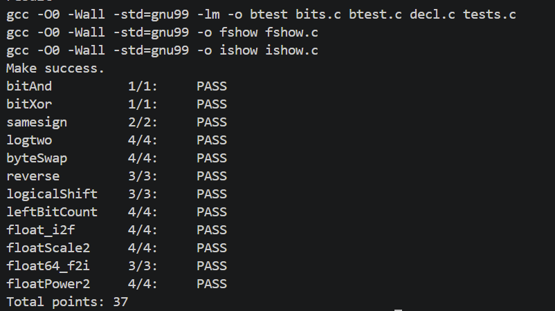
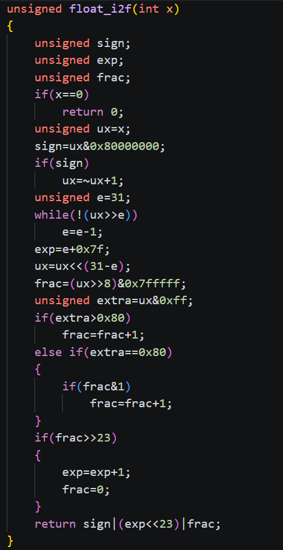
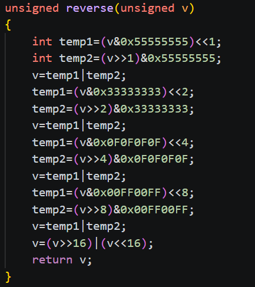

# datalab 报告

姓名：张闫熙

学号：2025200666

| 总分 | bitXor | logtwo | byteSwap | reverse | ... |
| --------- | ------------- | ------------- | ------------- | ----------------- |-----------|
| 1.00         | 1.00             | 2.00             | 4.00             | 4.00 |···  |


test 截图：


<!-- TODO: 用一个通过的截图，本地图片，放到 imgs 文件夹下，不要用这个 github，pandoc 解析可能有问题 -->

## 解题报告

### 亮点

<!-- 告诉助教哪些函数是你实现得最优秀的，比如你可以排序。不需要展开，展开请放到后文中。 -->

1. float_i2f
2. reverse

### float_i2f

```c
// 附上题目解题代码
```

首先使用 ux 保存整数的无符号形式，并通过最高位得到符号位。对于负数，使用补码运算 ~ux + 1 得到绝对值。之后从第 31 位开始寻找绝对值中最高位的 1，得到最高位的位置 e，同时得到exp。找到最高位后，将它移动到第 31 位，使整数变成统一的规格化形式。移动后的第 30 到第 8 位作为 frac，最低 8 位作为舍入信息。舍入时作分类，低 8 位大于 0x80，向上舍入；低 8 位等于 0x80 时，只有 frac 最低位为 1 才向上舍入；如果 frac 舍入后溢出，则指数加 1，frac 清零。最后将符号位、指数位和 frac 使用按位或运算合并。

### reverse


我的实现采用分组交换的方法，而不是逐位处理。首先交换相邻的单个比特，然后交换相邻的 2 位、4 位和 8 位，最后交换高低 16 位。
掩码 0x55555555 的二进制形式是交替出现的 0101，可以选出偶数位置的比特。通过左右移位，就能完成相邻比特的交换。
之后使用：0x33333333 交换相邻的 2 位；0x0F0F0F0F 交换相邻的 4 位；0x00FF00FF 交换相邻的 8 位；最后交换高低 16 位
每完成一轮，交换的分组大小就扩大一倍，最终实现整个 32 位序列的反转。

## 反馈/收获/感悟/总结

<!-- 这一节，你可以简单描述你在这个 lab 上花费的时间/你认为的难度/你认为不合理的地方/你认为有趣的地方 -->

<!-- 或者是收获/感悟/总结 -->

<!-- 200 字以内，可以不写 -->
本次 lab 花费了较多时间。开始时我对补码、移位和掩码不太熟悉，容易混淆逻辑含义和位运算。通过逐步分析测试结果，我掌握了使用移位、掩码和分组处理解决问题的方法，也加深了对整数二进制表示的理解。虽然难度较高，但调试通过时很有成就感。

## 参考的重要资料

<!-- 有哪些文章/论文/PPT/课本对你的实现有重要启发或者帮助，或者是你直接引用了某个方法 -->

<!-- 请附上文章标题和可访问的网页路径 -->
无